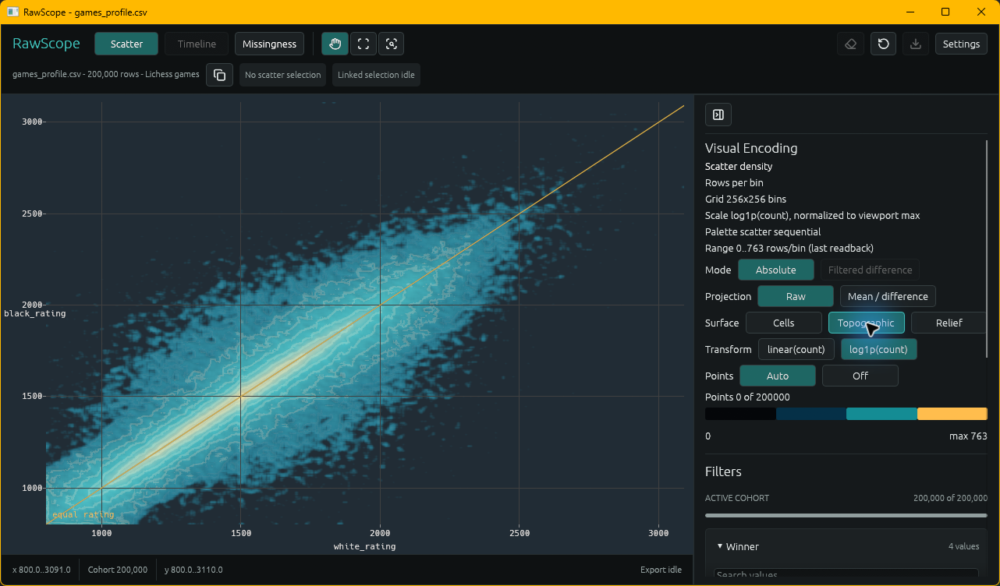
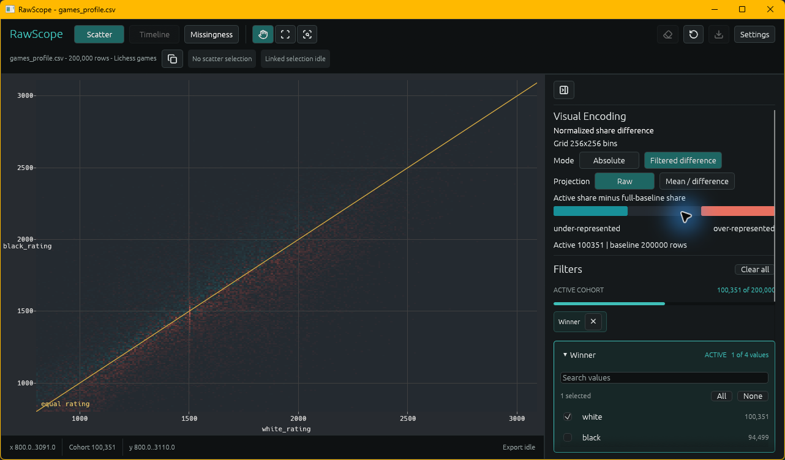
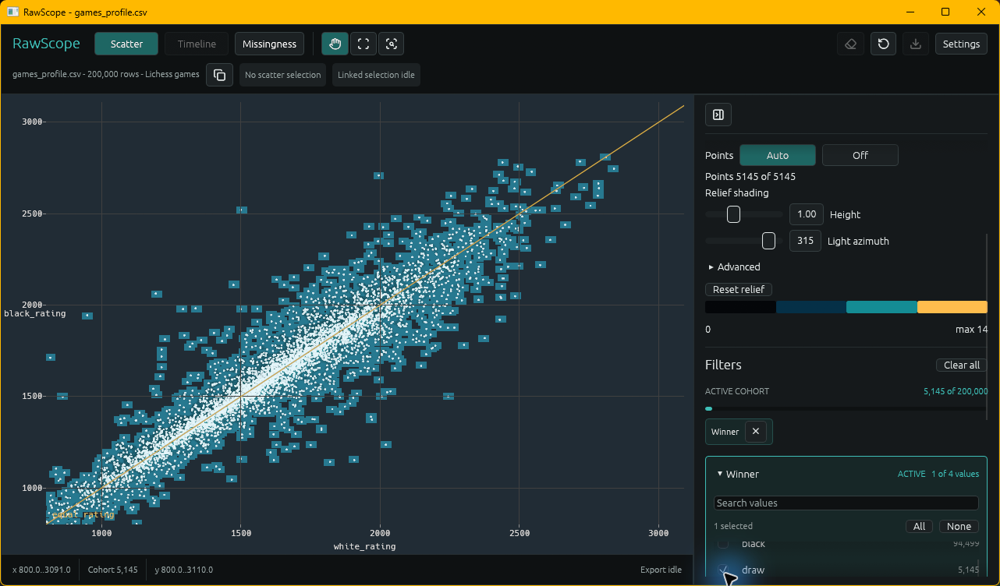

# RawScope

See the shape before writing the query.

RawScope is a GPU-scale visual analytics engine for large raw datasets. It helps analysts, researchers, data scientists, and big data engineers visually inspect the shape of data before they know exactly what SQL query, notebook analysis, dashboard, or model they need.

Current status: native visual-analysis workbench with deterministic synthetic data, local CSV and Parquet loading, GPU scatter/timeline density rendering, cohort filters and comparisons, row-level visual evidence, a local missingness slice, and versioned evidence report-bundle export.

## Workbench Tour

### See the full dataset shape



*Topographic GPU density over 200,000 games. Each game contributes a White-rating/Black-rating point; the equality guide and contours make matchmaking structure visible without drawing 200,000 overlapping markers.*

### Compare a cohort with its baseline



*Filtered difference for the 100,351 games won by White versus the full 200,000-game baseline. Coral regions are proportionally over-represented in the active cohort; teal regions are under-represented.*

### Trace aggregate structure back to rows



*A sparse 5,145-game draw cohort with deterministic individual-row markers over the density field. Filters, active-cohort counts, exact bins, inspection, and exported evidence preserve the path from visible structure back to source rows.*

## Target Users

- Analysts investigating changes, anomalies, data quality, and top contributors
- Researchers exploring large experimental datasets, embeddings, clusters, and repeatable views
- Data scientists checking feature drift, label imbalance, outliers, and cohort differences
- Big data engineers debugging pipeline regressions, missing partitions, schema drift, null spikes, and freshness gaps

## Goals

RawScope is built around five product and technical goals:

- Show full-dataset visual shape before users commit to a query, dashboard, notebook analysis, or model.
- Keep zooming, panning, brushing, and future linked views smooth as datasets grow.
- Bridge visual patterns back to row-level evidence through stable row ids, selection summaries, and exportable artifacts.
- Stay local-first for private datasets and early forensic exploration.
- Produce reproducible evidence reports that preserve view context, selected regions, summaries, and sampled or exact supporting rows.

See `docs/GOALS.md` for the fuller goal model.

## Supported Today

RawScope currently supports:

- Deterministic synthetic scatter point datasets with stable `RowId`s, category labels, dense clusters, background points, and sparse outliers.
- Deterministic synthetic timeline event datasets with stable `RowId`s, lanes, injected spike/gap/stale-lane/high-value patterns, and event types.
- CPU reference scatter and timeline density grids for deterministic correctness checks.
- WGPU bootstrap for native window rendering, surface resize handling, adapter metadata logging, and headless compute tests.
- GPU scatter-density count binning and simple fullscreen log-scaled scatter density rendering.
- GPU timeline-density count binning and simple fullscreen log-scaled timeline density rendering.
- Exact-cell, topographic, and relief presentations over the same explainable scatter-density counts.
- Deterministic categorical and numeric cohort filters with active-row counts and GPU mask updates.
- Filtered-versus-baseline normalized-share difference density.
- Bounded automatic point reveal, density-bin inspection, pinned row samples, and selected-row drilldown.
- Mouse-wheel zoom, drag pan, reset, and viewport re-binning for scatter and timeline modes.
- Deterministic scatter point-count presets from 20,000 to 5,000,000 synthetic points.
- Data-anchored rectangular brush selections for scatter and timeline views.
- CPU-side selected-region summaries for scatter brushes, including selected count, percentage, data extents, category counts, and top category.
- CPU-side selected-event summaries for timeline brushes, including selected count, percentage, lane counts, event-type counts, top lane/type, timestamp extent, and value extent.
- Deterministic CPU-side evidence objects for finalized scatter and timeline selections, including lowest-row-id samples.
- Local report-bundle export for scatter and timeline selections, including `evidence.json`, `evidence.md`, `manifest.json`, and a deterministic `visual-context.txt` placeholder; new scatter exports use additive evidence v5 while explicit v1-v4 formats remain available.
- Local CSV and Parquet loading for scatter density with explicit numeric `--x`/`--y` columns.
- Local CSV and Parquet loading for timeline density with explicit integer `--time` and string or integer `--lane` columns.
- Optional `--limit <rows>` for local CSV and Parquet loading.
- A production-oriented egui workbench shell with explicit interaction modes, profile-aware filters, visual encoding controls, concise dataset identity, comparison context, and selected-row drilldown.
- A local Python bridge for file paths plus pandas, Polars, and PyArrow inputs; dataframe inputs are materialized into temporary or persistent Parquet session bundles.
- A feature-gated Rust adapter boundary, with SpanFold interval comparisons transformed into evidence-preserving CSV session bundles.
- A CPU-backed missingness heatmap slice for local datasets with retained source rows, including cell selection and row-id summaries for missing values.
- Profile-independent numeric-pair and time-value visual-field contracts with bounded category composition, cohort comparison, density ridges, semantic point planning, and exact-count evidence semantics. These generic owners are covered by neutral deterministic integration tests and the documented production-path benchmark targets; the native launcher remains intentionally focused on its scatter and discrete-lane timeline demos.

These features are still correctness-first and visual-proof oriented. RawScope does not claim universal performance from one machine, full GPU row-id preservation, in-app screenshot capture, or a generic live mode switch in the launcher.

Benchmark commands, benchmark input sizes, GPU opt-in rules, and claim guidance live in `docs/BENCHMARKS.md`.

## Current Workbench

Run the native scatter-density demo with:

```powershell
cargo run -p rawscope-workbench
```

Run the native timeline-density demo with:

```powershell
cargo run -p rawscope-workbench -- --demo timeline
```

Run a local scatter-density view with explicit numeric columns from `.csv` or `.parquet` input:

```powershell
cargo run -p rawscope-workbench -- --demo scatter --input data.parquet --x latency_ms --y payload_size
```

The executable Lichess showcase demonstrates how an external Rust crate uses
RawScope's consumer API to prepare and launch a profile-aware session:

```powershell
cargo install --path apps/rawscope-workbench
cargo run --release -p rawscope-showcase-lichess -- run C:\data\games_profile.csv
```

See [`showcases/lichess`](showcases/lichess) for the input schema, preparation-only
command, and integration code.

Run a local timeline-density view with an integer timestamp and string or integer lane column from `.csv` or `.parquet` input:

```powershell
cargo run -p rawscope-workbench -- --demo timeline --input events.parquet --time timestamp --lane provider
```

Add `--limit <rows>` to cap the first imported rows. For local Parquet input, the current slice supports numeric scatter bindings plus integer timestamp and string or integer lane timeline bindings, retains source-row evidence, and records chunk metadata for the Arrow-backed read path.

Controls:

- Visible toolbar and panels: switch scatter or timeline mode, open the local-data missingness slice when source rows are available, inspect dataset/view status, clear selections, reset, export, and inspect selected rows.
- Mouse wheel: zoom the current viewport. Scatter zooms x/y around the cursor; timeline zooms the visible time range.
- Left or middle mouse drag: pan the current data viewport. Timeline mode pans time while lane mapping remains stable.
- Right mouse drag or Shift + left mouse drag: create or replace a visible rectangular brush selection.
- `Escape`: clear the current brush selection.
- `E`: export the latest finalized selection evidence for the active demo as a local report bundle under `target/rawscope-exports/`.
- `R`: reset to the full synthetic data range.
- `1`: switch to 20,000 synthetic points.
- `2`: switch to 200,000 synthetic points.
- `3`: switch to 1,000,000 synthetic points.
- `4`: switch to 5,000,000 synthetic points.
- `P` or `F12`: screenshot capture is currently skipped in-app; use the OS screenshot tool for now.

The scatter view uses deterministic synthetic point data by default, or local rows from CSV or Parquet input when `--input`, `--x`, and `--y` are provided. It recomputes GPU density counts for the current viewport and presents current state through the egui shell: a top toolbar for active view and selection actions, a right drilldown panel for selected rows, and a bottom status bar for axis ranges and export status. The window title remains a thin projection of that same UI state. Selected-region summaries are computed on CPU from the active point records and include selected row count, percentage, brush x/y ranges, selected data extents, category counts, and top category. The workbench does not present these values as GPU benchmark results.

Timeline note: `--demo timeline` uses deterministic synthetic event data by default, or local rows from CSV or Parquet input when `--input`, `--time`, and `--lane` are provided. It renders GPU timeline-density counts as a simple full-window view where x is time, y is lane/source, and intensity is event count. Mouse wheel zooms time, left or middle drag pans time, and `R` resets to the full time range; each viewport change re-bins the visible time range while lane mapping remains stable. Right-drag or Shift + left-drag creates a data-anchored timeline brush over a time/lane region, and the egui shell reports a CPU-side selected-event summary with event count, selected percentage, lane counts, event-type counts, top lane/type, timestamp extent, and value extent. Once finalized, timeline brushes also cache deterministic CPU-side evidence with the lowest selected row ids and sampled event records, and `E` exports that cached evidence. The injected spike, gap, and stale-lane patterns should be visible in synthetic mode. Timeline rendering is still intentionally narrow: no arbitrary timestamp normalization, linked multi-view coordination, or screenshot capture are included yet. The current GPU timeline path deliberately keeps the `u32` time-span guard from Milestone 4A.

Missingness note: when the current dataset comes from a local source with retained source rows, the egui shell also exposes a `Missingness` surface. The first slice is CPU-backed and uses retained source rows rather than a GPU pass. Cells are bucketed by row range and column, missingness is currently defined as trimmed-empty string values, and clicking a cell summarizes missing counts, selected columns, and sorted row ids that explain that region. This slice is intended as a data-quality foothold, not a full profiling system or benchmark path.

Brush overlay note: the current rectangle overlay is intentionally simple: a faint amber fill with a brighter border, rendered after the density pass. During drag, the rectangle follows screen-space mouse movement. Once finalized, the selection is anchored to data-space x/y ranges, and the overlay is projected back into the current viewport after zoom, pan, resize, or reset. Fully offscreen selections are hidden; partially visible selections are clamped to the viewport edge. Preset changes clear the brush because the synthetic dataset changes.

Selection evidence note: finalized brushes also build a small CPU-side evidence object from active records. Scatter evidence includes selected counts, category counts, min/max x/y, brush range, dataset seed/row count, and a deterministic sample of the lowest selected row ids plus point records. Timeline evidence includes selected counts, lane and event-type counts, selected timestamp/value ranges, brush time/lane ranges, dataset seed/row count, and a deterministic sample of the lowest selected row ids plus event records. This is logged once when the brush finalizes and remains a CPU evidence path rather than GPU row-id preservation.

Evidence export note: pressing `E` writes the active demo's cached selection evidence into a collision-safe bundle directory under `target/rawscope-exports/`. Scatter exports use `report-scatter-<unix-ms>-<counter>/`; timeline exports use `report-timeline-<unix-ms>-<counter>/`. Each bundle contains `evidence.json`, `evidence.md`, `manifest.json`, and `visual-context.txt`. Legacy bundles use the deterministic placeholder context; new scatter v5 bundles record the visual-query, session, and pinned-inspection context while native image capture remains deferred. If no finalized brush evidence exists in the active demo, the app logs a warning and does not write files. These bundles are local-first CPU-side evidence artifacts, not cloud publishing or a final screenshot pipeline.

The library-owned report adapter also writes the additive
`rawscope.visual-field-evidence` v1 artifact for generic numeric-pair and
time-value projections, including composition, comparison, ridge, contour,
marginal, and semantic-sample disclosures. The current `E` shortcut remains
limited to the native scatter/timeline selection artifacts; generic mode export
is exercised by the workbench benchmark target and is not presented as a live
launcher feature yet.

## Python Bridge

The optional source-installable SDK opens the same native workbench from a
local file or an in-memory dataframe:

```python
import rawscope

rawscope.view(
    games,
    view=rawscope.ScatterView("white_rating", "black_rating"),
    evidence_key="game_id",
)
```

Install an ecosystem extra with `pip install -e "sdk/python[pandas]"`,
`"sdk/python[polars]"`, or `"sdk/python[arrow]"`. File-backed sessions require
an explicit destination; dataframe sessions default to an owned temporary
Parquet bundle that lives until the launched process is waited on or
terminated. Set `RAWSCOPE_WORKBENCH` when the native executable is not on
`PATH`. The bridge is local-only, materializes data rather than streaming it,
and supports the session v1 contract documented in
[`docs/schemas/session-v1.md`](docs/schemas/session-v1.md) and the additive
scatter evidence v5 contract in
[`docs/schemas/scatter-selection-evidence-v5.md`](docs/schemas/scatter-selection-evidence-v5.md).
The additive session v2 bindings also map profile-free numeric-pair and
time-value roles, with an optional bounded category, into the shared visual-field
controller contract; legacy v1 sessions remain readable.

Inspection facts are exact for the selected density cell and active cohort;
row ids, natural keys, and category values are bounded samples when the cell
contains more rows than the configured sample limit. The v5 report labels
those samples and preserves the session identity without copying the full
dataset into the artifact.

Screenshot capture note: in-app screenshot capture is intentionally deferred because native surface readback and image encoding would add a dedicated capture path or extra dependencies. For Milestone 3D, OS-level screenshots are the recommended path.

## Rust Adapters

`rawscope-adapters` is the Rust boundary for preparing source-specific data and
opening it in the native workbench. Integrations are feature-gated sibling
modules, so consumers only compile the source SDKs they select. SpanFold is the
first integration:

```powershell
cargo install --git https://github.com/Scottlr/RawScope rawscope-workbench --locked
```

```toml
[dependencies]
rawscope-adapters = { git = "https://github.com/Scottlr/RawScope", branch = "main", features = ["spanfold"] }
spanfold = "=0.1.1"
```

```rust,no_run
use rawscope_adapters::spanfold::SpanfoldIntervalTransform;
use spanfold::ComparisonResult;

fn inspect(result: &ComparisonResult) -> Result<(), Box<dyn std::error::Error>> {
    let prepared = SpanfoldIntervalTransform::default()
        .prepare_session(result, "provider-qa.rawscope")?;
    let mut workbench = prepared.launch()?;
    workbench.wait()?;
    Ok(())
}
```

The default transform materializes SpanFold overlap, residual, missing, and
coverage ranges into one CSV-backed session. `all_intervals()` additionally
includes gap, symmetric-difference, and containment ranges. Exact `start`,
`end`, and source record ids stay in the retained rows; the default scatter
uses `start_offset` relative to the earliest range and `duration` so large
timestamp magnitudes do not unnecessarily consume visual-coordinate precision.
Point-oriented lead/lag and as-of results are not coerced into intervals.
Every materialized row preserves SpanFold's authoritative row id, finality,
finality reason, metadata version, and superseded-row id. Coverage rows expose
their row-level ratio as `segment_coverage_ratio`; aggregate coverage remains
owned by SpanFold's `coverage_summaries`.

Prepared sessions use the same session-v1 contract as the Python bridge. The
shared `PreparedAdapterSession` can launch `rawscope-workbench` from `PATH`, or
from the `RAWSCOPE_WORKBENCH` environment variable. The adapter crate is still
workspace-private (`publish = false`) but can be consumed as a Git dependency;
downstream applications should pin a commit instead of tracking `main`. Its
public boundary is separated now so additional integrations can be added and the
crate can be published deliberately later. Enabling the SpanFold feature
currently requires Rust 1.95 because SpanFold 0.1.1 declares that toolchain
baseline.

## Current Crate Responsibilities

- `docs/`: project intent, architecture, goals, MVP milestones, and agent guidance
- `crates/rawscope-core`: shared foundational types, row ids, ranges, grid sizes, row-count density grids, and count-only density grids
- `crates/rawscope-data`: deterministic synthetic point/event data, local CSV and Parquet loading, dataset metadata, schema summaries, retained source rows, and chunk metadata for current views
- `crates/rawscope-session-contracts`: versioned session manifest wire types and bounded schema constants
- `crates/rawscope-session`: local session validation/resolution plus native workbench launching
- `crates/rawscope-adapters`: feature-gated source transforms that prepare normal RawScope sessions; currently SpanFold interval comparisons
- `crates/rawscope-gpu`: WGPU surface context, headless compute context, adapter metadata, resize handling, and clear-frame status
- `crates/rawscope-render`: CPU density references, GPU scatter/timeline density compute, simple density renderers, viewport math, brush geometry, selection summaries/evidence, and evidence artifact formatting
- `apps/rawscope-workbench`: native `winit` workbench that coordinates startup args, WGPU context, active view state, input handling, brushing, title-bar summaries, and evidence export

### Data feature matrix

`rawscope-data` keeps local adapter dependencies opt-in at the crate boundary:

- The default `csv` feature provides the minimal CSV adapter.
- The `parquet` feature enables Arrow-backed Parquet loading and implies `csv`
  because the shared lane and row-validation contracts are used by both adapters.
- The native workbench explicitly enables `csv,parquet`; consumers that only need
  synthetic data, filtering, or the typed store can disable both adapters with
  `default-features = false`.

The feature selection changes dependency availability, not runtime behavior of a
workbench build. A disabled adapter returns a typed `DatasetLoadError::FeatureDisabled`
instead of silently treating the source as another format.

## Deferred Work

The next larger areas remain intentionally deferred:

- Broader UI work such as file dialogs, richer layout management, and screenshot/report capture.
- GPU row-id preservation and exact row drilldown from rendered density bins.
- Broader Parquet logical-type coverage and richer columnar ownership beyond the current scatter/timeline bindings and chunk metadata.
- Linked multi-view selection, selected-vs-baseline comparison, and visual query persistence across scatter, timeline, and missingness.
- Native screenshot/readback capture and image-backed visual context inside report bundles.
- Arbitrary timestamp normalization for timeline data beyond the current `u32` GPU time-span guard.
- Broader performance analysis, optimization follow-up, and claim-backed benchmark result tracking.
- Tauri, web/WASM, cloud workflows, plugin systems, SQL/DataFusion, and dataframe-style execution.

## Non-Goals

RawScope is not a generic charting library, BI dashboard builder, Tableau/Grafana/Plotly clone, SQL database, dataframe engine, notebook replacement, cloud analytics platform, or general-purpose UI framework. It should complement these tools by focusing on local-first visual exploration of large raw datasets, with a clear path from visible patterns back to row-level evidence.

## Development Status

This repository is still intentionally small and milestone-driven. The current workbench proves synthetic and local CSV/Parquet scatter/timeline density workflows, GPU-side count aggregation, a restrained egui control shell, data-anchored brushing, CPU-side evidence, and local export artifacts. Keep future work focused on RawScope's visual exploration and row-evidence path; avoid broad import systems, generic charting features, BI/dashboard behavior, Tauri packaging, cloud services, plugin systems, or dataframe/query abstractions until the product milestones call for them.
